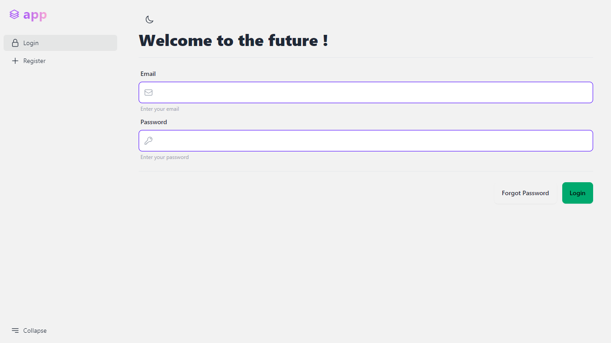

<p align="center"></p>

## About Mary UI Auth Template
This template saves your time by providing basic authentication features out of the box !

Based on [Mary-ui](https://mary-ui.com)



#### Includes ?
- Login
- Register
- Email verification
- Forgot password
- Reset password


#### How to use it ?
- Create a repository using this template or fork it.
Then run the commands below : 
```bash
composer install
 
php artisan mary:install

php artisan key:generate

php artisan migrate

php artisan serve

yarn dev

```
- Follow the [Mary-ui documentation](https://mary-ui.com/docs/installation)

## Contributing

Send a PR ✉

## Security Vulnerabilities

If you discover a security vulnerability within this template, please send an e-mail to Pratik kuikel via [herecomeslucky0145@gmail.com](mailto:herecomeslucky0145@gmail.com). All security vulnerabilities will be promptly addressed.

## License

This template is open-sourced software licensed under the [MIT license](https://opensource.org/licenses/MIT).
